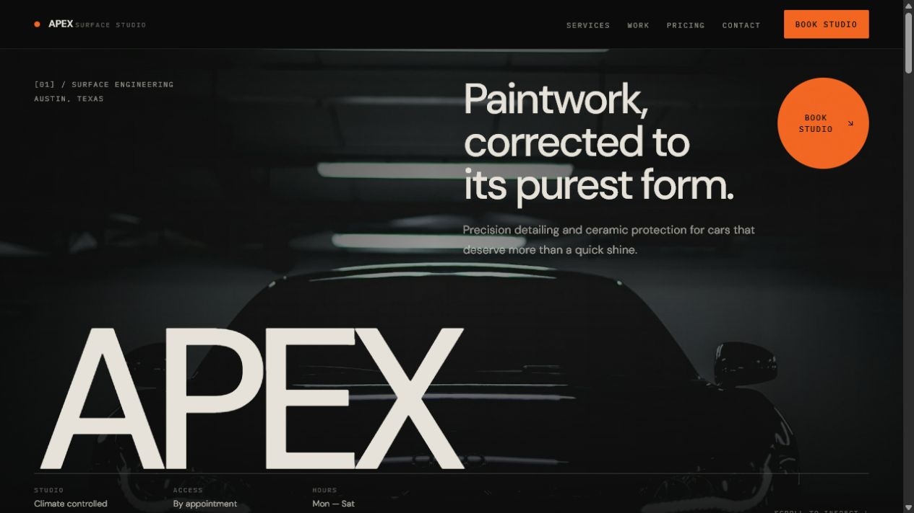

# APEX Detailing

Premium automotive detailing and ceramic coating landing page built as a production-quality Next.js portfolio project.

### [View the live APEX Detailing experience →](https://apex-detailing-six.vercel.app/)



## Case study

- **Live demo:** [apex-detailing-six.vercel.app](https://apex-detailing-six.vercel.app/)
- **Source code:** [github.com/Ciokapick/apex-detailing](https://github.com/Ciokapick/apex-detailing)

## Status

Independent portfolio project. APEX Detailing is a fictional studio; business details, pricing, testimonials and imagery are demonstration content.

## Overview

APEX Detailing is a single-page marketing site for a premium automotive detailing and ceramic coating studio. Its visual direction borrows from automotive editorial design rather than the familiar card-heavy SaaS formula: oversized type, asymmetric grids, close-cropped imagery and a restrained carbon, mineral and workshop-orange palette.

The project was built from scratch to demonstrate production-ready front-end work rather than only visual composition. Its component architecture, responsive behavior, accessible navigation, interaction states, image strategy, metadata and deployment configuration are all part of the deliverable.

## Features

- Responsive sticky navigation with a keyboard-accessible mobile menu
- Cinematic automotive hero with an oversized responsive wordmark
- Editorial service layout for detailing, coating, correction and interior care
- Six-image modular gallery with restrained hover treatment
- Comparative three-tier pricing section with a highlighted studio choice
- Final booking call-to-action with contact details
- Shared design tokens for color, typography, spacing and motion
- Reduced-motion support, semantic landmarks and descriptive image alternative text
- Static rendering with no runtime services or environment variables required

## Tech stack

- **Framework:** Next.js 15 with the App Router
- **Language:** TypeScript in strict mode
- **UI:** React 19, Tailwind CSS 3, Lucide React
- **Typography:** DM Sans and IBM Plex Mono through `next/font`
- **Images:** Unsplash assets optimized through `next/image`
- **Deployment:** Vercel

## Technical decisions

- **One source of truth for buttons.** Every call-to-action and the mobile menu trigger use the same polymorphic `Button` component. Primary, secondary and ghost variants share their hover, active, focus-visible and disabled behavior instead of repeating interaction classes throughout the page.
- **Accessible mobile navigation.** The menu exposes `aria-expanded` and `aria-controls`, moves focus into the opened panel, closes on Escape and returns focus to its trigger. Hidden menu links are removed from the keyboard tab order.
- **Small reusable primitives.** `Section`, `Card` and `PricingCard` own the recurring layout and presentation rules, while section components remain focused on content and composition.
- **Stable responsive geometry.** The asymmetric desktop compositions collapse into deliberate single-column reading order, while the gallery and contact details progressively expand at larger breakpoints.
- **Performance-conscious rendering.** The page is statically rendered, the hero image is prioritized, gallery images are lazy-loaded with responsive `sizes`, fonts are self-hosted by Next.js and all imagery has reserved geometry to avoid layout shift.

## Running locally

Requires Node.js 20.9 or newer and npm.

```bash
npm ci
npm run dev
```

The site is available at [http://localhost:3000](http://localhost:3000).

For a production run:

```bash
npm run build
npm run start
```

### Useful commands

```bash
npm run typecheck
npm run lint
npm run build
npm audit
```

## Deployment

The project uses standard Next.js defaults and requires no environment variables or custom Vercel configuration.

```bash
npx vercel
npx vercel --prod
```

The GitHub repository is connected to Vercel, so pushes to `main` automatically create a new production deployment.

## License / Portfolio use

Source published for portfolio review. The implementation was written from scratch without a template, UI kit or page builder.
